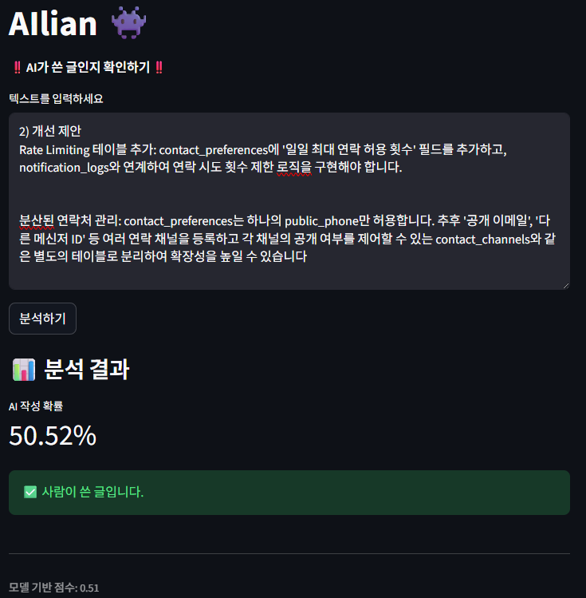
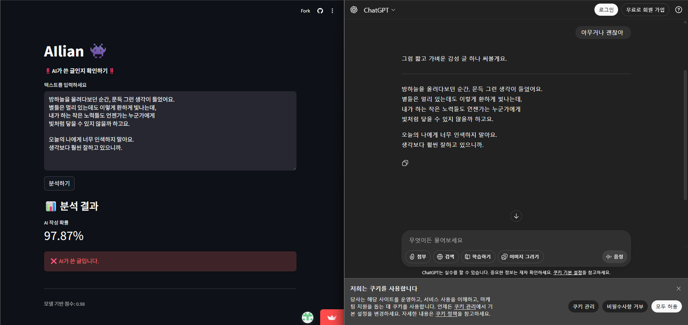
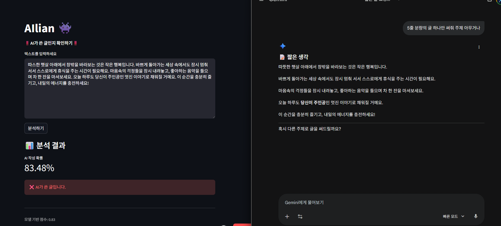

#  👾 AIlian 

AIlian은 텍스트가 AI가 작성한 글인지, 사람이 작성한 글인지를 판별하는 웹 애플리케이션입니다.
Hugging Face의 openai-community/roberta-base-openai-detector 모델을 사용하여 간단하고 빠르게 AI 작성 확률을 제공합니다.
※ AI가 쓴 글의 가능성을 직접 판단하는 것이 아닌 모델을 사용하여 판단하는 웹 애플리케이션을 만든 것입니다.

※ 본 프로젝트의 라이선스 : MIT License 입니다. 따라서 MIT 라이선스 조건에 따라 자유롭게 사용, 수정, 배포할 수 있습니다. 다만, 본 프로젝트를 사용함으로 인해 발생하는 모든 책임은 사용자에게 있음을 명시합니다.

--- 

# 사용된 오픈소스

Python
https://www.python.org/  

Streamlit
https://streamlit.io/  

MIT License
https://opensource.org/licenses/MIT  

HuggingFace (모델)
https://huggingface.co/openai-community/roberta-base-openai-detector  

---

### 사용방법
링크 : https://will-be-copykiller-lc4jmymnod2qfce8r2o9xr.streamlit.app/
1. 링크에 접속한다.
2. 텍스트란에 테스트할 문장을 입력한다
3. 분석하기 버튼을 누른다.
4. ‼️결과를 확인한다‼️

---

# 프로젝트 상세설명
 
 📦 AIlian
├── app.py                       # Streamlit UI 
├── images/                      # 리드미 파일용 이미지 폴더
├── requirements.txt             # 필요한 라이브러리 목록
└── utils/
   └── model_based.py           # AI Detector 모델 
   
 이 프로젝트는 위와 같이 구성되어 있습니다.
  
 웹 애플리케이션은 이렇게 디자인 되었고 라이트/다크 모드로 전환아 가능하고 Wide mode도 지원합니다. (사실 미적감각이 부족하여 기본적이게 됐습니다,,)
- app.py: Streamlit을 사용하여 웹 애플리케이션의 UI를 구성하고, 사용자 입력을 받아 AI 작성 확률을 계산하여 결과를 표시하는 화면을 표시합니다. Streamlit을 사용하여 사용자가 따로 설치할 필요없이 바로 브라우저에서 사용가능하게 만들었고 링크를 누르면 바로 접속가능합니다.
- model_based.py: Hugging Face의 transformers 라이브러리를 사용하여 모델을 로드하고, 입력된 텍스트에 대해 AI 작성 가능성 확률을 계산합니다. (다만 이 모델은 영어 기반 GPT-2 출력 탐지용으로 설계됐기에 사람과 AI글의 기준을 70점으로 설정하였고, 한국어나 다른 언어에 적용할 경우에 높은 정확도를 보이진 않으나 테스트 결과로는 사람의 글과 AI의 글을 잘 분류하여 유의미한 결과를 보였습니다.)
- requirements.txt: 프로젝트에 필요한 Python 라이브러리와 해당 버전을 명시한 파일입니다.

---

# 프로젝트 테스트 예제 및 결과

위의 사진은 제가 쓴 프로젝트 보고서의 일부를 넣어서 테스한 사진입니다.

위의 두 사진은 각각 ChatGPT가 쓴 글과 Gemini가 쓴 글을 넣어서 테스타한 사진입니다.
사람이 쓴 글도 50점이 넘게 나오지만 AI가 쓴 글은 확실하게 80점 이상의 점수를 보이기에 시림이 쓴 글과 AI가 쓴 글을 확실하게 구분한다고 볼 수 있습니다.

---

# 한계 및 보안점
- 현재 모델은 영어 기반 GPT-2 출력 탐지용으로 설계되었기에 한국어나 다른 언어에 적용할 경우에 정확도가 불안정하고 현재 GPT-5.0의 글은 잘 탐지하지 못할 수 있습니다.
- AI 작성 확률이 70점 이상인 경우 AI가 작성한 글로 간주하지만, 이는 절대적인 기준이 아닌 임의로 부여한 기준이기에 정확하지 않을 수 있습니다.

- 앞으로 더 나은 성능 향상을 위해 모델에만 의지하지 않고 한국어 기반의 실제 글을 수집하고 분석하여 점수를 계산하여 모델의 점수와 합쳐서 점수를 내면 프로그램의 정확도를 더 올릴 수 있을 것 같습니다.
- 더 예쁘고 보기 좋게 UI/UX 디자인을 개선하여 좋은 인상을 주고, 파일업로드와 같은 추가적인 기능들을 추가하면 더 편리한 웹 애플리케이션이 될 수 있을 것 같습니다.
